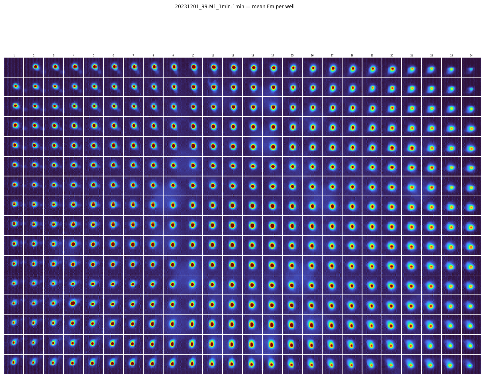
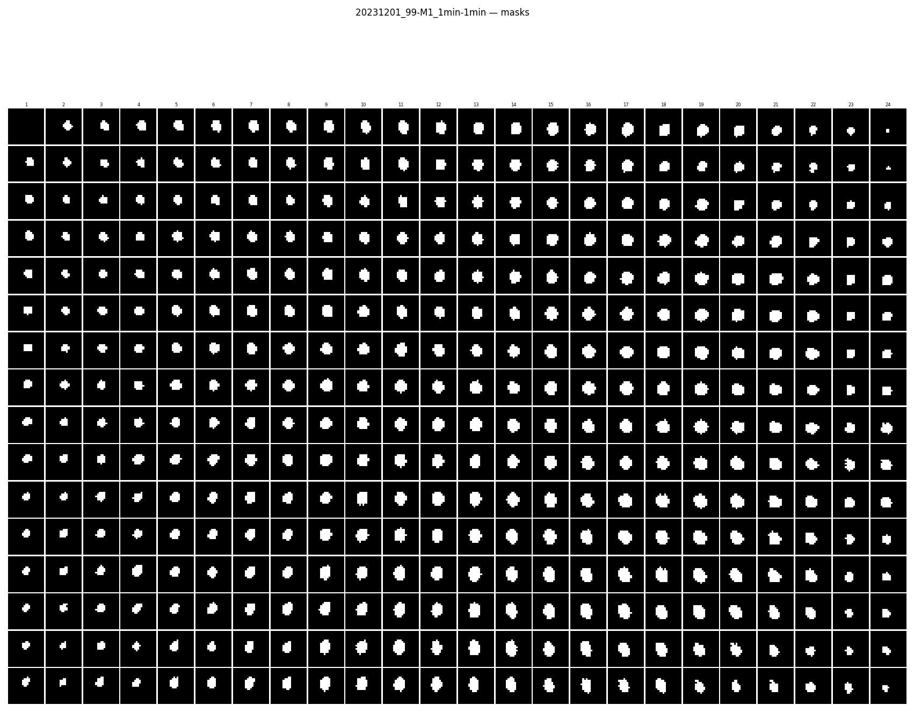
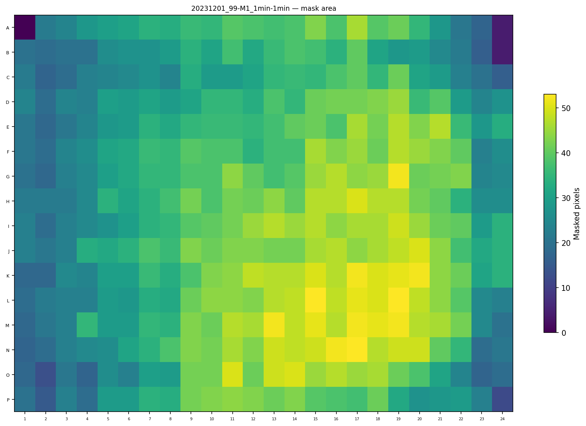
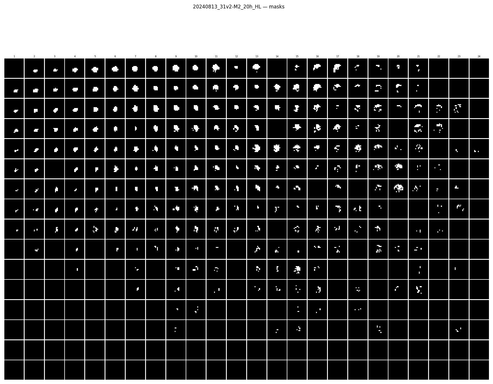
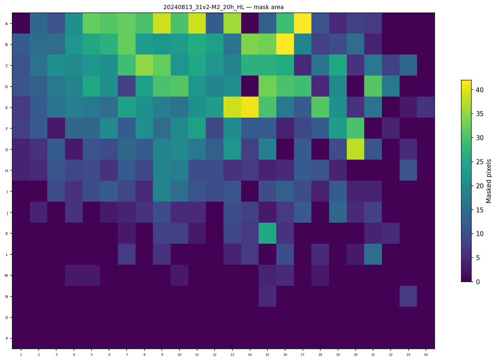
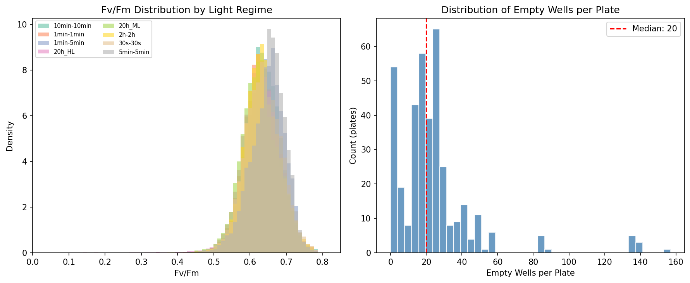
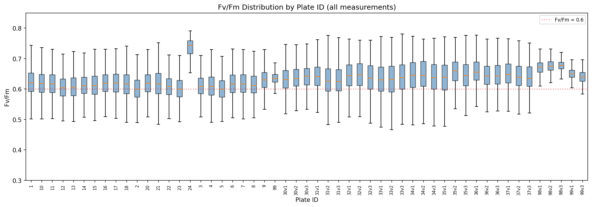
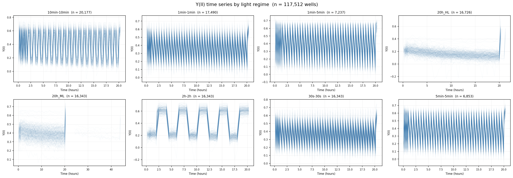
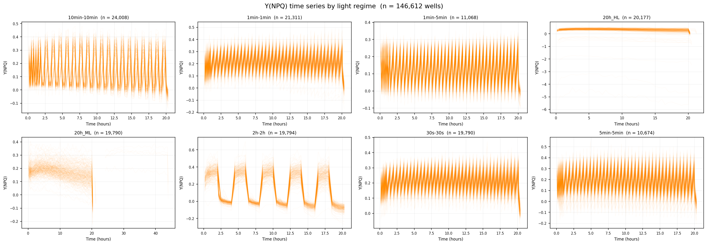

# Chlamy-IMPI Pipeline Report

**Report version:** {{ site.report_version }} |
**Date:** {{ site.report_date }} |
**Pipeline:** {{ site.pipeline_version }}

---

## Executive Summary

This report documents the Chlamy-IMPI data processing pipeline, which extracts photosynthetic parameters from fluorescence imaging of *Chlamydomonas reinhardtii* mutants grown in 384-well plates.

### Key numbers

| Metric | Value |
|---|---|
| Raw TIF/CSV pairs processed | **350** |
| Plates passing error correction | **350 / 350** (100%) |
| Unique plate IDs in database | **41** |
| Unique plate IDs in experimental data | **48** (7 excluded: no identity mapping) |
| Light regimes | **8** |
| Total wells in database | **134,112** |
| Non-empty wells (valid signal) | **126,502** (94.3%) |
| Empty wells (no algal colony) | **7,610** (5.7%) |
| Timeseries data points | **9,151,584** |
| Date range of experiments | Oct 2023 -- Feb 2026 |
| Database columns | **726** |
| Database rows | **117,512** |

### Photosynthetic parameter summary (non-empty wells)

| Parameter | Mean | Median | Std |
|---|---|---|---|
| Fv/Fm | 0.633 | 0.633 | 0.051 |
| Y(II) | 0.363 | 0.339 | -- |
| Y(NPQ) | 0.180 | 0.188 | -- |

The pipeline is **stable and reproducible**: consecutive runs (2026-02-25 vs 2026-02-26) produced identical databases with 0 parameter differences exceeding quality thresholds.

---

## Contents

1. [Pipeline Architecture](#pipeline-architecture)
2. [Stage 0: Error Correction](#stage-0-error-correction)
3. [Stage 1: Well Segmentation](#stage-1-well-segmentation)
4. [Stage 2a: Image Processing & Masking](#stage-2a-image-processing--masking)
5. [Stage 2b: Database Creation](#stage-2b-database-creation)
6. [Timeseries Outputs](#timeseries-outputs)
7. [Data Quality & Known Issues](#data-quality--known-issues)
8. [Appendix: Database Schema](#appendix-database-schema)

---

## Pipeline Architecture

The pipeline runs in four sequential stages. Each stage reads from the previous stage's output directory.

```
data/                          (raw TIF + CSV files)
      |
      v
[Stage 0]  Error Correction
      |    output/cleaned_raw_data/
      v
[Stage 1]  Well Segmentation
      |    output/well_segmentation_cache/   (.npy arrays)
      v
[Stage 2a] Image Processing
      |    output/image_processing/          (3 parquets + mask PNGs)
      v
[Stage 2b] Database Creation
           output/database_creation/         (database.csv + plots)
```

**Input data format:** Each experiment produces a paired `.tif` (multi-frame fluorescence images) and `.csv` (measurement timestamps) file. Each TIF contains alternating dark (F0) and light (Fm) frames -- two frames per measurement timepoint. The 384-well plates are arranged in a 16-row x 24-column grid.

**Output:** A single canonical `database.csv` (117,512 rows x 726 columns) containing per-well photosynthetic parameters, timeseries data, and genetic identity for all experiments.

---

## Stage 0: Error Correction

Stage 0 reads raw TIF/CSV pairs and applies a sequence of automated corrections before validation.

### Raw TIF structure

Every raw TIF has a fixed header that must be stripped:

| Frames | Content | In CSV? |
|---|---|---|
| [0, 1] | Warmup duplicate | No |
| [2, 3] | Pre-measurement trigger (usually black) | No |
| [4, 5] | Measurement 0 | Yes (row 0) |
| [6, 7] | Measurement 1 | Yes (row 1) |
| ... | ... | ... |

### Correction sequence

1. **Remove warmup pair** -- strips frames 0-1 (TIF only, always present)
2. **Remove black frame pairs** -- removes pre-measurement trigger pairs; also removes mid-experiment half-black artifacts from both TIF and CSV
3. **Remove duplicate initial frame pair** -- safety net for rare double-warmup
4. **Remove spurious frames** -- automated timestamp-based detection (see algorithm below)
5. **Validate** -- asserts frame count, TIF/CSV alignment, no black frames, monotone timestamps, interval consistency

### Spurious-frame detection algorithm

Each spurious measurement event inserts one extra CSV row (and two extra TIF frames) into an otherwise clean sequence. Because the spurious row's timestamp falls *between* two legitimate rows, it creates a pair of consecutive anomalously short inter-row intervals whose sum equals roughly one normal interval.

**Steps:**
1. Compute `n_to_remove = csv_rows − target_rows`, where `target_rows` is the largest valid frame count ≤ `2 × csv_rows` divided by two. If `2 × csv_rows` is already valid, `n_to_remove = 0`.
2. Compute inter-row intervals (seconds) from the `Date`/`Time` columns.
3. Scan the interval sequence for the first anomalous interval in each spurious pair: a row is flagged as spurious if the interval *preceding* it falls outside all expected ranges for the plate's time regime.
4. Each flagged row index `k` removes two TIF frames (`2k`, `2k+1`) and one CSV row from the metadata.
5. Assert the resulting frame count is in the valid set; raise if not.

Expected intervals (per time regime) are defined in `database_creation/constants.py`. All regimes include a `(900 s, 940 s)` dark-recovery step before the final measurement.

### Results

- **350 / 350 plates pass** (100%)
- 3 plates have known timestamp anomalies (camera clock drift or DST rollback) but **valid image data and correct frame counts**. They are **included in the final database**. These plates are exempt from timestamp monotonicity and interval-consistency checks but pass all other validation:

| Plate | Reason |
|---|---|
| `20231102_4-M4_20h_ML` | 24-hour gap (experiment interrupted overnight) |
| `20231104_4-M6_10min-10min` | US DST clock rollback, Nov 2023 |
| `20241102_33v3-M6_10min-10min` | US DST clock rollback, Nov 2024 |

Any future plate with similar clock issues must be added to the exemption list in `error_correction/validation.py`; it will otherwise fail validation.

### Valid frame counts by time regime

| Time regime | Valid frame counts |
|---|---|
| 30s-30s | 160, 162, 164, 172, 178, 180 |
| 1min-1min | 160, 162, 164, 172, 180 |
| 10min-10min | 160, 162, 164, 172, 180 |
| 1min-5min | 180 |
| 5min-5min | 180 |
| 2h-2h | 82, 84, 98, 100 |
| 20h_ML | 82, 84, 92 |
| 20h_HL | 82, 84, 90, 92 |

Lower counts (82, 160, 162) correspond to truncated experiments. Higher counts (90, 98, 178) are Phase II variants with additional measurements.

---

## Stage 1: Well Segmentation

Stage 1 uses the `segment-multiwell-plate` library to locate and extract individual wells from each TIF frame. The output is one `.npy` array per plate with shape `(16, 24, num_frames, H, W)` where each well is a 21x21 pixel sub-image.

### Sample well mosaic -- good plate

Plate `99-M1_1min-1min` (control plate, 1 Dec 2023):



*16x24 grid showing mean Fm (light) fluorescence per well. Bright wells contain algal colonies; dark wells are empty.*

---

## Stage 2a: Image Processing & Masking

Stage 2a computes per-well photosynthetic parameters from the segmented arrays.

### Masking algorithm

Each 21x21 pixel well image must be masked to isolate the algal colony from the background. The pipeline uses **global 3-sigma thresholding**:

1. Pool all dark frames across all timesteps; compute a single threshold = blank mean + 3σ (blank = top-left well, which is always empty)
2. Repeat independently for light frames
3. Collapse each pixel's time series to its minimum value; a pixel is included only if its minimum exceeds both thresholds
4. Wells with fewer than 3 masked pixels are treated as empty

This method was selected after comparing 5 candidate approaches (see [Masking Method Comparison](#masking-method-comparison) below).

### Sample mask mosaic -- good plate



*Binary masks for plate 99-M1. White = algal colony pixels; black = background. The top-left well is the blank reference.*

### Mask heatmap -- good plate



*Heatmap of masked pixel count per well. Well-populated plates typically have 30-40 masked pixels per well (out of 441 total).*

### Mask mosaic -- plate with low cell viability



*Binary masks for plate `31v2-M2_20h_HL`. The majority of wells contain no masked pixels, indicating that cell fluorescence did not exceed the background threshold.*

### Mask heatmap -- plate with low cell viability



*Heatmap of masked pixel count per well for plate `31v2-M2_20h_HL`: only 237 of 384 wells have masks of ≥3 pixels. Plates with large numbers of empty wells are retained in the database; empty wells are recorded with NaN parameter values.*

### Masking method comparison

Five masking strategies were evaluated across all 350 plates:

| Method | Empty wells | Mean mask size | Y(NPQ) valid? |
|---|---|---|---|
| **Global min 3-sigma** | **7,454 (5.6%)** | **37.3 px** | **No** |
| Global mean 3-sigma | 7,014 (5.2%) | 60.5 px | No |
| Global min 5-sigma | 7,754 (5.8%) | 30.6 px | Yes |
| Per-timestep 3-sigma | 7,459 (5.6%) | 37.9 px | No |
| Per-timestep 5-sigma | 7,704 (5.7%) | 31.0 px | Yes |

Using the pixel-wise minimum over time before thresholding is key: pixels whose fluorescence is near background at any single frame (which would corrupt Fv/Fm and Y(NPQ) denominators) are excluded. The global mean method produces oversized masks because it is not robust to bright outlier frames. The per-timestep variants compute a separate threshold for each frame, which is more principled but substantially slower; in practice they produce near-identical masks to the global min approach. The selected method (global min 3-sigma) is fast and interpretable. It produces out-of-range Y(NPQ) values (< −2.0) for a small minority of wells in plates 31v2 and 99, where physical conditions drive the measurement beyond the expected range; these are retained in the database as-is.

### Photosynthetic parameters computed

- **Fv/Fm** = (Fm - F0) / Fm -- maximum quantum yield of PSII (single value per well)
- **Y(II)** -- effective quantum yield at each timepoint (timeseries)
- **Y(NPQ)** -- non-photochemical quenching at each timepoint (timeseries)

All values are pixel-level averages over the masked region of each well.

### Fv/Fm distributions



*Left: Fv/Fm density by light regime -- distributions are similar across regimes, centred around 0.63. Right: distribution of empty wells per plate -- median is ~20 empty wells per plate (out of 384).*

### Fv/Fm by plate ID



*Box plots of Fv/Fm per plate ID across all measurements.*

---

## Stage 2b: Database Creation

Stage 2b joins the Stage 2a parquets with the identity spreadsheet (mapping wells to mutant strains) and produces the final canonical database.

### Outputs per run

Each run creates a dated subdirectory containing:
- `database_YYYY-MM-DD.csv` -- dated snapshot
- `comparison_<old>_to_<new>.md` -- regression comparison against previous run
- `timeseries_y2.png` -- Y(II) timeseries mosaic
- `timeseries_ynpq.png` -- Y(NPQ) timeseries mosaic
- `gene_descriptions.csv` -- summary of genetic annotations

A canonical `database.csv` is also written for backwards compatibility.

### Identity spreadsheet coverage

The identity spreadsheet maps `(plate, well_id)` to mutant identifiers. Mismatches between the spreadsheet and the experimental data are logged as errors/warnings and result in data being silently excluded from the final database.

**Plates in experimental data but not in the identity spreadsheet** (7 plates — excluded from database):

| Plate |
|---|
| `34v1` |
| `34v2` |
| `34v3` |
| `35` |
| `35v1` |
| `35v2` |
| `35v3` |

These plates have valid segmentation and parameter data (Stage 2a) but cannot be included without mutant identity information. The identity spreadsheet must be updated to include them before they appear in the database.

**Plates in identity spreadsheet but not in experimental data** (1 plate):

| Plate |
|---|
| `99v2` |

No TIF/CSV data exists for plate `99v2`; it appears in the identity spreadsheet but was never imaged (or not yet processed).

**Dropped (plate, well) combos** (117 total):

117 non-blank wells across 12 plates exist in the experimental data but have no entry in the identity spreadsheet. They are silently dropped from the database during the identity merge. The per-plate breakdown is:

| Plate | Dropped wells | Notable pattern |
|---|---|---|
| `20` | 4 | G12, K24, O23, O24 |
| `21` | 16 | Scattered |
| `22` | 14 | Scattered |
| `23` | 17 | Scattered |
| `24` | 11 | Contiguous block N14–N24 |
| `30v1` | 1 | B01 |
| `30v2` | 1 | K13 |
| `30v3` | 1 | J13 |
| `31v1` | 17 | B02, L23, L24, and contiguous block P11–P24 |
| `31v2` | 17 | Scattered |
| `31v3` | 17 | Scattered |
| `99v3` | 1 | P24 |

Plates 20–24 and 31v1–31v3 account for the majority of dropped wells. The contiguous gaps in plate `24` (N14–N24) and `31v1` (row P) indicate entire row segments were omitted from the spreadsheet rather than individual missing entries.

### Database versioning

The pipeline supports versioned databases. Each run is saved with its date, and an automatic regression comparison is generated against the most recent previous run. The comparison checks for:
- Row count changes
- Schema changes (columns added/removed)
- Plate additions/removals
- Wells that change from empty to non-empty or vice versa
- Parameter diffs exceeding thresholds (Fv/Fm > 0.05, Y(II) > 0.10)

**Latest comparison (2026-02-25 vs 2026-02-26):** No changes detected -- identical row counts (117,512), no schema changes, no parameter diffs.

### Experiments per light regime

| Light regime | Plate count |
|---|---|
| 10min-10min | 58 |
| 1min-1min | 50 |
| 20h_HL | 49 |
| 20h_ML | 48 |
| 2h-2h | 48 |
| 30s-30s | 47 |
| 1min-5min | 25 |
| 5min-5min | 25 |

---

## Timeseries Outputs

The pipeline generates per-light-regime timeseries mosaics showing Y(II) and Y(NPQ) traces across all wells.

### Y(II) timeseries



*Y(II) (effective PSII quantum yield) traces by light regime. Each grey line is an individual well; the blue line is the population median. Y(II) typically decreases under sustained illumination as photoprotective mechanisms activate.*

### Y(NPQ) timeseries



*Y(NPQ) (non-photochemical quenching) traces by light regime. NPQ generally increases over time as the algae activate photoprotective energy dissipation pathways.*

---

## Data Quality & Known Issues

### Overall quality

- **100% of raw plates** pass automated error correction (3 plates exempt from timestamp checks)
- **94.3% of wells** have valid signal (mask area >= 3 pixels)
- **0 regression failures** between consecutive pipeline runs
- **7 plates excluded** from the database (in experimental data but missing from identity spreadsheet)
- **117 wells dropped** across 12 plates (no identity entry)

### Tiny mask wells

156 wells (0.12% of total) across 67 plates have masks of only 1-2 pixels. These are zeroed out and treated as empty, as statistics from 1-2 pixels are meaningless.

Top outlier plates with many tiny-mask wells:

| Plate | Tiny-mask wells | Empty wells | Healthy wells |
|---|---|---|---|
| `31v2-M2_20h_HL` | 55 | 92 | 237 |
| `7-M1_1min-1min` | 6 | 46 | 332 |
| `31v1-M5_2h-2h` | 4 | 21 | 359 |

The top outlier (`31v2-M2_20h_HL`) is likely a plate-level failure rather than an algorithmic issue.

### Plates with timestamp anomalies

Three plates have known camera clock issues (overnight interruption or DST rollback) that produce invalid timestamps, but their image data and frame counts are correct. They are **included in the final database** and exempt only from timestamp validation:

| Plate | Issue |
|---|---|
| `20231102_4-M4_20h_ML` | 24-hour gap in timestamps |
| `20231104_4-M6_10min-10min` | DST clock rollback |
| `20241102_33v3-M6_10min-10min` | DST clock rollback |

### Recommendations

1. **Plate `31v2-M2_20h_HL`** should be flagged for manual review due to very low signal
2. **Update the identity spreadsheet** to add entries for plates `34v1`, `34v2`, `34v3`, `35`, `35v1`, `35v2`, `35v3` (currently excluded from the database) and for the 117 dropped wells across plates 20–24, 30v1–30v3, 31v1–31v3, and 99v3 — see [Identity spreadsheet coverage](#identity-spreadsheet-coverage)
3. Future DST-affected plates should be added to the exemption list in `error_correction/validation.py`
4. The masking threshold (global min 3-sigma) uses the pixel-wise minimum over time, so borderline wells at plate edges where signal varies between frames are more likely to be excluded

---

## Appendix: Database Schema

The final `database.csv` contains 726 columns and 117,512 rows. One row per (plate x measurement x well).

### Identification columns

| Column | Description |
|---|---|
| `plate` | Plate ID (e.g., "1", "30v2", "99") |
| `measurement` | Measurement label (e.g., "M1", "M2") |
| `start_date` | Experiment start date |
| `i`, `j` | Well row (0-15) and column (0-23) |
| `well_id` | Well identifier (e.g., "A1", "P24") |
| `light_regime` | Time regime (e.g., "1min-1min", "20h_HL") |

### Photosynthetic parameters

| Column(s) | Description |
|---|---|
| `fv_fm` | Maximum PSII quantum yield |
| `fv_fm_std` | Standard deviation of Fv/Fm across masked pixels |
| `mask_area` | Number of masked pixels in the well |
| `y2_1` ... `y2_177` | Y(II) timeseries (NaN-padded) |
| `y2_std_1` ... `y2_std_177` | Y(II) standard deviation timeseries |
| `ynpq_1` ... `ynpq_177` | Y(NPQ) timeseries |
| `measurement_time_0` ... `measurement_time_177` | Timestamps per timepoint |

### Genetic identity

| Column | Description |
|---|---|
| `mutant_ID` | Mutant identifier from identity spreadsheet |
| `feature` | Genetic feature |
| `mutated_genes` | Gene(s) affected |
| `num_mutations` | Number of mutations |
| `confidence_level` | Confidence in genetic annotation |

---

*This report was auto-generated from pipeline run {{ site.report_date }}. Report version {{ site.report_version }}.*

*Pipeline source: [chlamy-imaging-pipeline](https://github.com/murraycutforth/chlamy-imaging-pipeline)*
